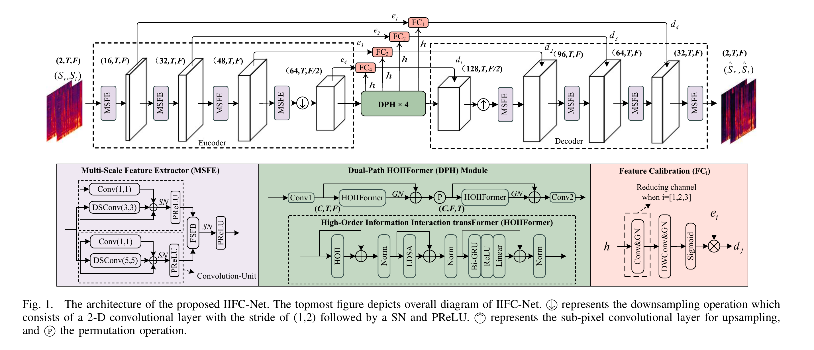

# IIFC-Net: A Monaural Speech Enhancement Network with High-Order Information Interaction and Feature Calibration
### Author: Wenbing Wei, Ying Hu, Hao Huang and Liang He

**Abstract :**
In this letter, we propose a monaural speech enhancement network with high-order information interaction and feature calibration (IIFC-Net), which includes high-order information interaction Transformer (HOIIFormer) with high-order information interaction (HOII) block instead of a multi-head self-attention (MHSA) in Transformer. 
IIFC-Net leverages dual-path HOIIFormer (DPH) to model the distant dependency relation along time and frequency dimensions, respectively, and effectively captures deep-level information through the HOII block. We also design a feature calibration (FC) block to enhance the frequency components of target speech, which can be verified by a visualization analysis.
Experimental results on the VoiceBank+DEMAND and WHAMR! datasets demonstrate that IIFC-Net achieves comparable performance in terms of denoising, dereverberation, and simultaneous denoising and dereverberation, while with fewer parameter counts (0.586M) and complexity.

Visit our [demo website](https://wenbingwei.github.io) for audio samples.

** Model architecture **

# Result
Denoising performance comparison with other systems on the VoiceBank+DEMAND dataset

| Model    | Par .(M) | MACs (G/s) | SISNR | PESQ | STOI (%) | CSIG | CBAK | COVL |
| -----    |--------  | ---------  | ----- | ---- | -------- | ---- | ---- | ---- |
| Noisy    |    ——    |     ——     | 8.45  | 1.97 |    92    | 3.34 | 2.45 | 2.63 |
| PHASEN   |   8.76   |     ——     |   ——  | 2.99 |    ——    | 4.21 | 3.55 | 3.62 |
| DCCRN    |   3.67   |    14.13   | 19.13 | 2.57 |    94    | 3.93 | 2.9  | 3.21 |
| TSTNN    |   0.92   |     ——     | 18.82 | 2.96 |    95    | 4.33 | 3.53 | 3.67 |
| SADNUNet |   2.63   |     ——     |   ——  | 2.82 |    ——    | 4.18 | 3.47 | 3.51 |
| FAF-Net  |   6.9    |   108.96   |   ——  | 3.19 |    95    | 4.13 | 3.38 | 3.66 |
| PFRNet   |   4.61   |     ——     |   ——  | 3.24 |    95    | 4.48 | 3.7  | 3.9  |
| D2Net    |   1.13   |    36.21   | 19.78 | 3.27 |    96    | 4.63 | 3.18 | 3.92 |
| IIFC-Net |  0.586   |    14.91   | 19.82 | 3.28 |    96    | 4.52 | 3.72 | 3.92 |

## The model code has been uploaded and the rest of code will be released soon ...

